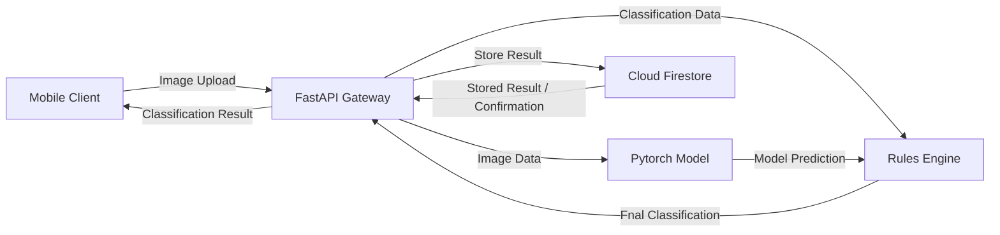

The Sortify system follows a client-to-backend-to-processing pipeline. The mobile client captures an image and sends it to the FastAPI backend. The backend processes the image using the Pythorch model and/or rules engine, then stores the resulting classification data in Cloud Firestore.

Data Flow

1. The mobile client captures an image.
2. The image is uploaded to the FastAPI Gateway.
3. FastAPI validates the request and image.
4. The image is passed to the Pythorch Model for inference.
5. The model returns a prediction to the Rules Engine.
6. The Rules Engine determines the final classification.
7. FastAPI stores the result in Cloud Firestore.
8. FastAPI returns the classification reuslt to the mobile client.

